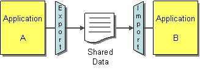
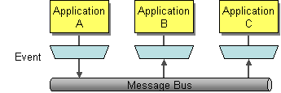
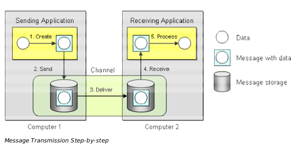
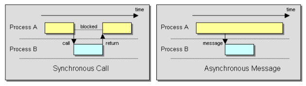
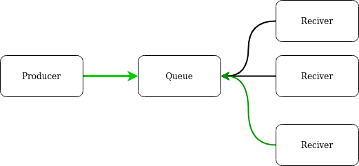
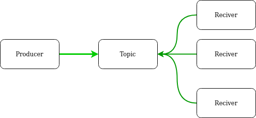
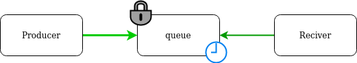

# messaging-cloud

Article about comparison solutions messaging in cluod

## Introdução

### Formas de comunicação entre aplicações

As nossas aplicações não vivem isoladas. Por isso necessitamos de interfaces de comunicação entre elas. E para realizar essa comunicação, nós temos alguns desafios:

* Redes não são confiáveis
* Redes são lentas
* Quais quer duas aplicação são diferentes
* Mudanças são inevitáveis

E para esses desafios, existem esses principais metodos de solução:

* File Transfer

* Shared Database

* RPC - The communication occurs real-time and synchronously

* Messaging - The communication is asynchronous

### O que é mensageria

Mensageria é a tecnologia que habilita a comunicação high-speed, asynchronous, program-to-program
 com entrega confiável. (Enterprise Integration Patterns - Addison Wesley)

#### Síncrono vs Assíncrono

### Benefícios da mensageria

* Remote Communication (desacoplamento de aplicações)
* Platform/Language Integration
* Asynchronous Communication
* Variable Timing
* Throttling
* Reliable Communication
* Disconnected Operation
* Mediation
* Thread Management (no Deadlock)

### Desafios da comunicação assíncrona

* Complex programming model
* Synchronous scenarios
* Performance
* Limited platform support
* Vendor lock-in (Protocols - JMS)

* Sequence issues (order)
* Idempotent action
* Unique read
* Unique write

### Formas de entregar mensagens

* Filas

* Tópicos

* Streams (stream é uma sequência ordenada, reproduzível e tolerante a falhas de registros de dados imutáveis, em que um registro de dados é definido como um par de valores-chave)
  

* Exchanges

## Soluções

### Local

#### Rabbit MQ

#### Kafka

### AWS

* SNS
* SQS
* Kinesis
  
### GCP

* Pub/Sub
* Dataflow

### Services

* **Kafka** - [Confluent.io](https://www.confluent.io/confluent-cloud)
* **RabbitMQ** - [cloudamqp](https://www.cloudamqp.com/)
* **Redis** - [redislabs](https://redislabs.com/)

## References

* Livros:
  * Enterprise Integration Patterns - Designing, Building And Deploying Messaging Solutions - Addison Wesley
* Artigos:
* Podcasts:
  * [CastOverflowEp. 17 - Mensageria](https://castbox.fm/episode/Ep.-17---Mensageria-id2989162-id274737224?country=us)
  * [Lambda3 Podcast 150 – Filas e mensageria](https://www.lambda3.com.br/2019/07/lambda3-podcast-150-filas-e-mensageria/)
  * [Opensanca Podcast14 - Mensageria](https://castbox.fm/episode/14---Mensageria-id2093967-id246025849?country=us)
  * [DevShow #19 – Mensageria](https://devshow.com.br/episode/devshow-19-mensageria/)
* Links:
  * [https://www.enterpriseintegrationpatterns.com/patterns/messaging/IntegrationStylesIntro.html](https://www.enterpriseintegrationpatterns.com/patterns/messaging/IntegrationStylesIntro.html)
  * [https://kafka.apache.org/uses](https://kafka.apache.org/uses)
  * [https://docs.confluent.io/current/kafka/introduction.html](https://docs.confluent.io/current/kafka/introduction.html)
  * [https://microservices.io/patterns/communication-style/messaging.html](https://microservices.io/patterns/communication-style/messaging.html)
  * [https://activemq.apache.org/how-does-a-queue-compare-to-a-topic](https://activemq.apache.org/how-does-a-queue-compare-to-a-topic)
