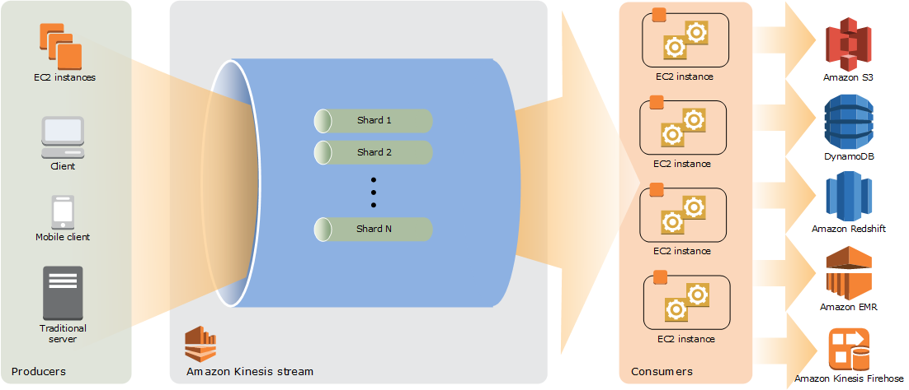

# messaging-cloud

Article about comparison solutions messaging in cluod

## Introdução

### Formas de comunicação entre aplicações

As nossas aplicações não vivem isoladas. Por isso necessitamos de interfaces de comunicação entre elas. E para realizar essa comunicação, nós temos alguns desafios:

* Redes não são confiáveis
* Redes são lentas
* Quais quer duas aplicação são diferentes
* Mudanças são inevitáveis

E para esses desafios, existem esses principais metodos de solução:

* File Transfer

* Shared Database

* RPC - The communication occurs real-time and synchronously

* Messaging - The communication is asynchronous

### O que é mensageria

Mensageria é a tecnologia que habilita a comunicação high-speed, asynchronous, program-to-program
 com entrega confiável. (Enterprise Integration Patterns - Addison Wesley)

#### Síncrono vs Assíncrono

#### Falhas do processamento

### Benefícios da mensageria

* Remote Communication (desacoplamento de aplicações)
* Platform/Language Integration
* Asynchronous Communication
* Variable Timing
* Throttling
* Reliable Communication
* Disconnected Operation
* Mediation
* Thread Management (no Deadlock)

### Desafios da comunicação assíncrona

* Complex programming model
* Synchronous scenarios
* Performance
* Limited platform support
* Vendor lock-in (Protocols - JMS)

* Sequence issues (order)
* Idempotent action
* Unique read
* Unique write

### Formas de entregar mensagens

* Filas

* Tópicos

* Streams (stream é uma sequência ordenada, reproduzível e tolerante a falhas de registros de dados imutáveis, em que um registro de dados é definido como um par de valores-chave)
  

* Exchanges

## Soluções

### Local

#### Rabbit MQ

**RabbitMQ** é um software open source de mensageria. Fornece uma forma comunicação assíncrona de dados entre processos, aplicações ou servidores. É um dos **brokers** de mensagens mais utilizados e implementa o protocolo **AMQP** — Advanced Message Queueing Protocol.

##### Principais Features RMQ

* Ordem: Não garante ordem
* Contexto: Broker de uso geral
* Modo de consumo: Push
* Tempo de vida da mensagem: Até ser consumido e ter tido o acknowledgment
* Garantia de entrega: Não garante atomicidade em transações de uma unica fila

#### Kafka

Criado pelo Linkedin e posteriormente doada para a Apache Foundation, o Apache Kafka é uma plataforma de streaming distribuída.

E uma plataforma de streaming distribuída consiste em:

* Publique e assine fluxos de registros, semelhantes a uma fila de mensagens ou sistema de mensagens corporativo;
* Armazene fluxos de registros de maneira durável e tolerante a falhas;
* Processe fluxos de registros conforme eles ocorrem;

Kafka é geralmente usado para duas grandes classes de aplicativos:

* Construção de pipelines de dados de streaming em tempo real que obtêm dados entre sistemas ou aplicativos de maneira confiável.
* Construção de aplicativos de streaming em tempo real que transformam ou reagem aos fluxos de dados.

##### Principais Features Kafka

* Ordem: Garante a ordem dentro da partição
* Contexto: Broker de alto volume de mensagens e plataforma de stream
* Modo de consumo: Pull
* Tempo de vida da mensagem: Policy de retenção
* Garantia de entrega: Não garante atomicidade  

### AWS

#### SNS

Amazon **Simple Notification Service** é um serviço de envio de mensagens de publicação/assinatura totalmente gerenciado, altamente disponível, seguro e durável que permite o desacoplamento de microsserviços, sistemas distribuídos e aplicativos sem servidor.

##### Principais Features SNS

* Ordem: Não garante ordem
* Contexto: mecanismo fácil para incorporar um sistema de notificação robusto com aplicativos
* Modo de consumo: Push
* Tempo de vida da mensagem: TTL padrão de quatro semanas
* Garantia de entrega: Sim, desde que o endpoint inscrito esteja acessível.

#### SQS

Amazon Simple Queue Service (SQS) é um serviço de filas de mensagens gerenciado que permite o desacoplamento e a escalabilidade de microsserviços, sistemas distribuídos e aplicativos sem servidor.

##### Principais Features SQS

* Ordem: Sim com parametro FIFO
* Contexto: Processamento distribuido
* Modo de consumo: Pull
* Tempo de vida da mensagem: configuravel 1 min - 14 dias, default 4 dias
* Garantia de entrega: Sim

#### kiensis

Amazon Kinesis é a solução para coletar e processar grandes streamings de registros em tempo real.
É o kafka da AWS com mais recursos.

* Kinesis Video Streams - Capture, processe e armazene streams de vídeo
* Kinesis Data Streams - Capture, processe e armazene fluxos de dados
* Kinesis Data Firehose - Carregue streams de dados em datastores da AWS
* Kinesis Data Analytics - Analise streams de dados com SQL ou Java

##### Principais Features Kinesis

* Ordem: Sim
* Contexto: Alto Processamento distribuido onde parte da analise e processamento é realizado nele
* Modo de consumo: Pull
* Tempo de vida da mensagem: Configuravel
* Garantia de entrega: Sim
  
### GCP

#### Pub/Sub

O Pub/Sub é um serviço de mensagens assíncronas que separa serviços que produzem eventos de serviços que processam eventos.

##### Principais Features Pub/Sub

* Ordem: Não garante ordem
* Contexto:  middleware orientado a mensagens ou ingestão e entrega de eventos para pipelines de análise de streaming.
* Modo de consumo: Push
* Tempo de vida da mensagem: Até ser consumida
* Garantia de entrega: Sim

#### Dataflow

O Dataflow é um serviço gerenciado para executar uma ampla variedade de padrões de processamento de dados. A documentação neste site mostra como implantar os pipelines de processamento de dados de streaming e em lote usando o Dataflow, incluindo instruções de uso dos recursos de serviço. 

##### Principais Features Dataflow

* Contexto:  Pipeline de dados - Processamento de dados.
* Modo de consumo: Push - ele vai entregar o dado
* Tempo de vida da mensagem: Até ser consumida
* Garantia de entrega: Sim

### Services

* **Kafka** - [Confluent.io](https://www.confluent.io/confluent-cloud)
* **RabbitMQ** - [cloudamqp](https://www.cloudamqp.com/)
* **Redis** - [redislabs](https://redislabs.com/)

## Demo kafka

[demo](demo/README.md)

## References

* Livros:
  * Enterprise Integration Patterns - Designing, Building And Deploying Messaging Solutions - Addison Wesley
* Podcasts:
  * [CastOverflowEp. 17 - Mensageria](https://castbox.fm/episode/Ep.-17---Mensageria-id2989162-id274737224?country=us)
  * [Lambda3 Podcast 150 – Filas e mensageria](https://www.lambda3.com.br/2019/07/lambda3-podcast-150-filas-e-mensageria/)
  * [Opensanca Podcast14 - Mensageria](https://castbox.fm/episode/14---Mensageria-id2093967-id246025849?country=us)
  * [DevShow #19 – Mensageria](https://devshow.com.br/episode/devshow-19-mensageria/)
* Links:
  * [https://www.enterpriseintegrationpatterns.com/patterns/messaging/IntegrationStylesIntro.html](https://www.enterpriseintegrationpatterns.com/patterns/messaging/IntegrationStylesIntro.html)
  * [https://kafka.apache.org/uses](https://kafka.apache.org/uses)
  * [https://docs.confluent.io/current/kafka/introduction.html](https://docs.confluent.io/current/kafka/introduction.html)
  * [https://microservices.io/patterns/communication-style/messaging.html](https://microservices.io/patterns/communication-style/messaging.html)
  * [https://activemq.apache.org/how-does-a-queue-compare-to-a-topic](https://activemq.apache.org/how-does-a-queue-compare-to-a-topic)
  * [https://medium.com/dev-cave/rabbit-mq-parte-i-c15e5f89d94](https://medium.com/dev-cave/rabbit-mq-parte-i-c15e5f89d94)
  * [https://github.com/spassos/kafka](https://github.com/spassos/kafka)
